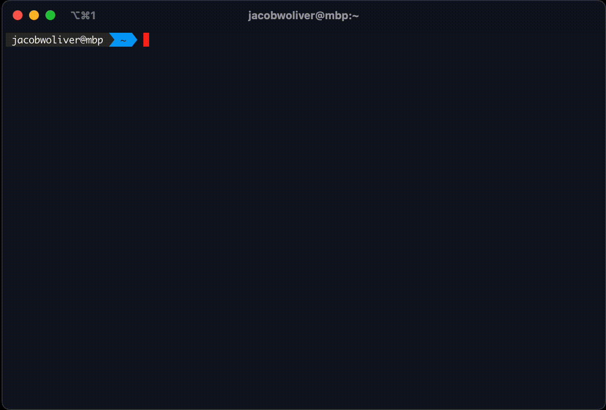

# `hui` - A visual alternative to `history` written in Rust



## Overview

`hui` is command-line tool to quickly search through your terminal history. The motivation behind this tool was having a prettier and faster way to do `history | grep <search>`. I would do this frequently to remember some `docker` or `curl`
command I had done recently, but couldn't remember the flags I used. This now lets me search through my history and copy the command I want a lot easier.

`hui` is built on top of [ratatui](https://github.com/tui-rs-revival/ratatui) for its TUI, or Terminal User Interface.

## Setup

### Installation

If you are on a Mac, you can install from `homebrew`:

```bash
brew tap jmwoliver/hui
brew install hui
```

Alternatively, you would like to install from source if you have `cargo` installed locally:

```bash
git clone https://github.com/jmwoliver/hui.git
cd hui
cargo build --release
# you can then alias the command so it is available in any directory:
# alias hui=<CURRENT_DIR>/target/release/hui
```

### Configuration

After installing `hui`, it will need to know which shell you are using. This can be done by setting the `HUI_TERM` environment variable.

For `zsh`, run the following commands:

```bash
echo 'export HUI_TERM="zsh"' >> ~/.zshrc
source ~/.zshrc
```

If you are using `bash`, run:

```bash
echo 'export HUI_TERM="bash"' >> ~/.bashrc
source ~/.bashrc
```

## Usage

Once everything is installed and the `HUI_TERM` environment variable is set, all you have to do to run it is:

```
hui
```

Now you can scroll through all your history, filter results, and select a command to copy to your clipboard.

Enjoy!

## Acknowledgements

I used several projects for inspiration or guidance:

- [ratatui](https://github.com/tui-rs-revival/ratatui): Incredible TUI framework and useful examples
- [hstr-rs](https://github.com/overclockworked64/hstr-rs/tree/master): Helped me better understand how to ingest and parse the `.zsh_history` file
- [hoard](https://github.com/Hyde46/hoard): Similar concept to `hui` and I liked how they had the searchbar at the bottom
